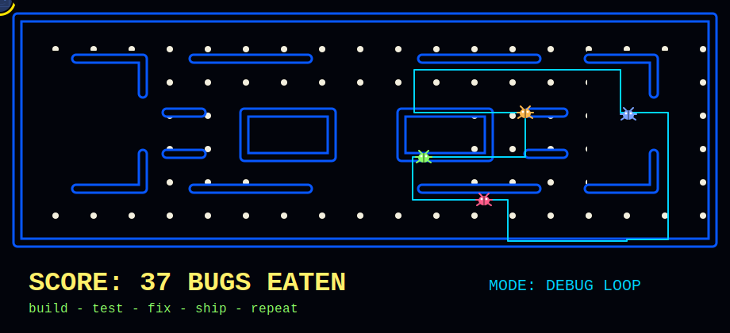

<div align="center">

# Sree Raj Muthaiya.A.L



### Passive-Coder: shipping code, chasing edge cases, eating bugs.

[](https://github.com/Passive-Coder)
[](#)
[](#)

</div>

## ./about

I build practical software with a bias for working demos, sharp UI, and systems that survive real inputs.

- Turning ideas into full-stack apps, automation scripts, and AI-assisted tools.
- Comfortable moving between Python, C++, JavaScript, React, Node.js, and the command line.
- Interested in developer tools, algorithms, applied AI, web experiences, and anything that makes boring work disappear.
- Current side quest: keep the bug counter at zero while the feature counter keeps climbing.

## ./toolbelt

<p align="center">
  
</p>

## ./pacman-log

```txt
PLAYER      Passive-Coder
MISSION     Eat bugs. Ship features. Repeat.
POWER-UPS   clean APIs | fast prototypes | readable code | useful automation
BOSS FIGHTS off-by-one errors | race conditions | broken builds | vague requirements
STATUS      waka waka... deploying
```

## ./stats

<div align="center">


</div>

## ./connect

Open an issue, start a discussion, or drop a star if something here helped you build faster.

```txt
while (bugs.length) {
  eatBug();
  commit("fix: one less thing haunting production");
}
```
